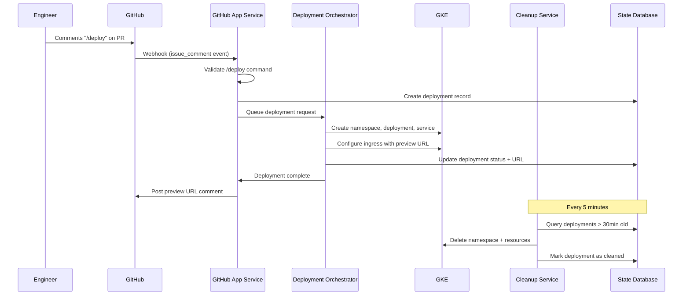

# Github PR Deploy Preview

This repository explores the design and early implementation of a **preview deploy service** that allows engineers to spin up ephemeral preview environments directly from a GitHub pull request.

The primary goal is to improve developer confidence and reduce production risk by making changes visible and testable before merge.

> ⚠️ This project is intentionally a **work in progress** and is focused on architecture, tradeoffs, and developer experience rather than full production hardening.

---

## Problem Statement

Before deploying to production, engineers benefit from seeing their changes live in an isolated environment. The desired developer experience is simple:

1. An engineer comments `/preview` on a pull request
2. A preview environment is deployed automatically
3. A preview URL is posted back to the PR
4. The environment is cleaned up after a fixed TTL

---

# Requirements 

1. Create a developer experience that involves an engineering executing a /preview command in github that kicks off the deploy to a preview environment and then provides a preview-url to the engineer.

2. After the preview is comlpeted, clean-up after one-self

3. Additional scenerios to consider, 50 PR /preview requests at a time.  

4. Partial prview deploys, where a container might orphaned, how do you handle that to prevent unnecessary costs. 

# Architecture Overview 

See /docs/descisions for design descisions

1. Hello World App - Simple Python static site container
2. Preview GitHub App Service  - Webhook server that listens for /preview command
3. Deployment Orchestrator - Manages GKE deployments and generates preview URLs
4. Cleanup Service - Handles cleanup and orphan detection

## Flow 

